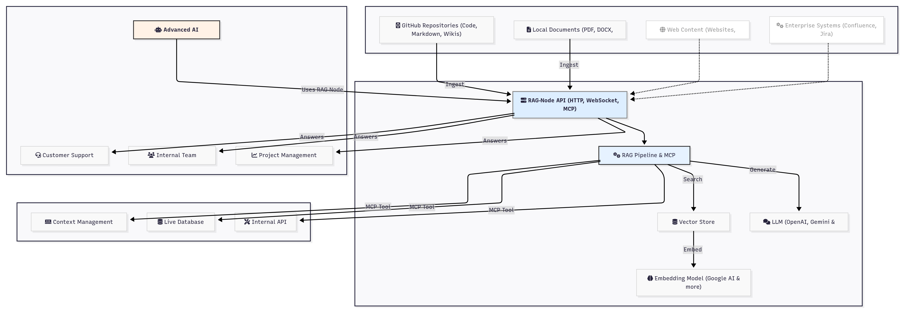
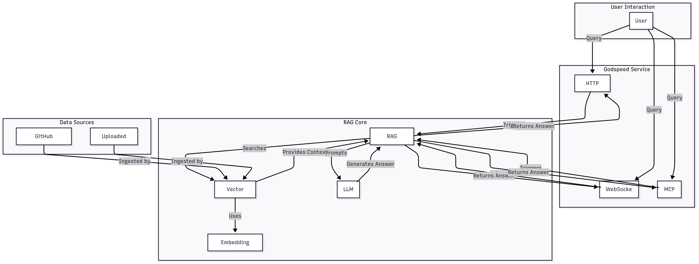
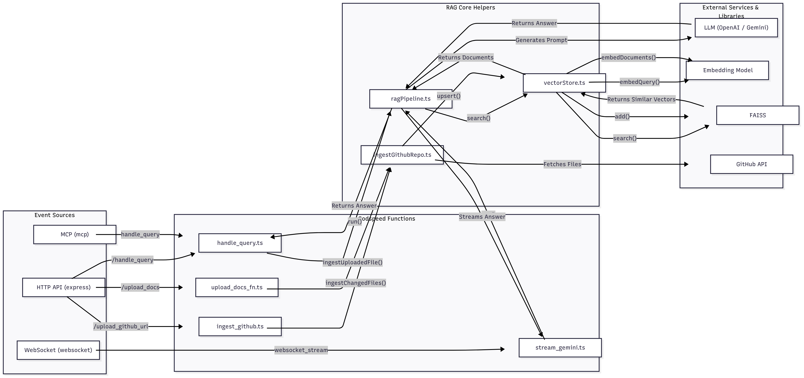

# RAG-Node: Your Enterprise-Ready RAG Service

RAG-Node is a powerful, standalone Retrieval-Augmented Generation (RAG) service designed for enterprise use. It allows you to build sophisticated question-answering systems on top of your own private data. Ingest documentation from GitHub, upload local files (PDF, DOCX, MD), and get accurate, context-aware answers from a Large Language Model (LLM).

Built for scalability and flexibility, RAG-Node can be deployed anywhere and integrated into any application, making it the perfect backend for intelligent chatbots, internal knowledge bases, customer support automation, and more.

## Table of Contents

- [High-Level Architecture](#high-level-architecture)
- [Low-Level Architecture](#low-level-architecture)
  - [Project Structure](#project-structure)
  - [Core Components](#core-components)
    - [Godspeed Core](#godspeed-core)
    - [Event Sources](#event-sources)
    - [Datasources](#datasources)
    - [Functions](#functions)
    - [RAG Pipeline](#rag-pipeline)
    - [Vector Store](#vector-store)
    - [Data Ingestion](#data-ingestion)
- [Features](#features)
- [Getting Started](#getting-started)
  - [Prerequisites](#prerequisites)
  - [Installation](#installation)
  - [Configuration](#configuration)
  - [Running the Service](#running-the-service)
- [API Endpoints](#api-endpoints)
- [Usage](#usage)
- [Future Enhancements](#future-enhancements)

## The RAG-Node Ecosystem: From Data to Decision

This diagram illustrates the complete lifecycle of information within the RAG-Node ecosystem, showcasing how it transforms raw, unstructured data into an intelligent, interactive knowledge base that powers various enterprise applications.



The RAG-Node service is an event-driven microservice that leverages a RAG pipeline to provide answers to user queries. The architecture is centered around the Godspeed framework, which orchestrates the various components of the system.



## Low-Level Architecture



### Project Structure

The project follows the standard Godspeed project structure:

- `config/`: Contains configuration files for different environments.
- `src/`: The main source code directory.
  - `datasources/`: Defines datasources for connecting to external services.
  - `events/`: Defines the events that the service listens to.
  - `eventsources/`: Configures event sources like HTTP, WebSockets, and MCP.
  - `functions/`: Contains the business logic for handling events.
  - `helper/`: Contains helper modules for the RAG pipeline, vector store, and data ingestion.
- `docs/`: Contains API documentation.

### Core Components

#### Godspeed Core

The application is initialized and managed by the `@godspeedsystems/core` library. The entry point of the application is `src/index.ts`, which creates a new Godspeed instance and initializes it.

#### Event Sources: The Front Door to Your RAG Service

Event sources are the entry points for all interactions with RAG-Node. They define *how* the service listens for incoming requests. RAG-Node is configured with three powerful event sources out-of-the-box, making it incredibly versatile.

- **HTTP (`express-as-http`):** This is the foundation for the REST API. It uses the robust and popular Express.js framework under the hood to handle standard HTTP requests. This is the most common way to interact with the service for tasks like uploading files, ingesting repositories, and asking questions in a request-response pattern. The configuration in `src/eventsources/http.yaml` defines the port and other settings for the HTTP server.

- **WebSocket:** For applications requiring real-time, bidirectional communication, the WebSocket event source is essential. It allows for the streaming of responses from the LLM directly to the client, creating a much more interactive and engaging user experience, similar to what you see in modern AI chatbots. The configuration in `src/eventsources/websocket.yaml` specifies the port for the WebSocket server.

- **MCP (Model Context Protocol):** This is a forward-looking feature that makes RAG-Node a "team player" in a larger ecosystem of AI agents. MCP is a standardized protocol that allows different AI models and tools to communicate and collaborate. By exposing an MCP endpoint (configured in `src/eventsources/mcp.yaml`), RAG-Node can be seamlessly integrated as a specialized "knowledge tool" by other, more complex AI agents or orchestrators.

#### Datasources

- **Axios (`axios-as-datasource`):** Used for making HTTP requests to external APIs, such as the GitHub API. The configuration is in `src/datasources/api.yaml`.

#### Functions

The business logic is implemented as functions that are triggered by events. Key functions include:

- `handle_query`: The main function for handling user queries.
- `ingest_github`: Ingests a GitHub repository into the vector store.
- `upload_docs_fn`: Ingests uploaded files into the vector store.
- `stream_gemini`: Handles streaming responses over WebSockets.

#### RAG Pipeline

The core of the service is the RAG pipeline, implemented in `src/helper/ragPipeline.ts`. The pipeline performs the following steps:

1.  **Search:** Searches the vector store for relevant documents based on the user's query.
2.  **Contextualization:** Creates a context from the retrieved documents.
3.  **Prompting:** Constructs a prompt for the language model, including the context and the user's query.
4.  **Generation:** Sends the prompt to the language model to generate an answer.

#### Vector Store

The vector store, implemented in `src/helper/vectorStore.ts`, is responsible for storing and searching document embeddings. It uses:

- **`faiss-node`:** For efficient similarity search in the vector space.
- **`@langchain/google-genai`:** To generate embeddings using Google's Generative AI models.

The vector store maintains an index of document embeddings and metadata, which is persisted to disk.

#### Data Ingestion

The service can ingest documents from two sources:

- **GitHub Repositories:** The `src/helper/ingestGithubRepo.ts` module contains logic for cloning a GitHub repository, extracting text from supported file types, and ingesting it into the vector store.
- **File Uploads:** The service can also ingest documents uploaded directly by the user. It supports various file formats, including PDF, DOCX, TXT, and MD.

## Features

- **Multi-Source Ingestion:** Ingest documents from GitHub repositories and file uploads.
- **Real-time Querying:** Get answers to your questions in real-time via HTTP or WebSockets.
- **Streaming Responses:** Receive answers as they are generated, providing a more interactive experience.
- **MCP Integration:** Use the RAG service as a tool within the Model Context Protocol ecosystem.
- **Extensible:** Easily extend the service to support new data sources and language models.

## Getting Started

### Prerequisites

- Node.js and pnpm
- A Google AI API key
- An OpenAI API key (or another compatible LLM provider)

### Installation

1.  Clone the repository:
    ```bash
    git clone https://github.com/hardik4tiwari/RAG.git
    cd RAG
    ```
2.  Install the dependencies:
    ```bash
    pnpm install
    ```

### Configuration

1.  Create a `.env` file in the root of the project.
2.  Add the following environment variables to the `.env` file:

    ```
    GOOGLE_API_KEY=<Your Google AI API Key>
    OPENAI_API_KEY=<Your OpenAI API Key>
    GITHUB_TOKEN=<Your GitHub Personal Access Token>
    ```

### Running the Service

To start the service in development mode, run:

```bash
godspeed serve
```

This will start the Godspeed server and watch for file changes.

## API Reference

RAG-Node provides a simple yet powerful REST API to manage your knowledge base and interact with the RAG pipeline.

### 1. Ingest a GitHub Repository

This endpoint allows you to ingest an entire public GitHub repository. The service will clone the repository, extract text from supported files, and add it to the vector store. This is ideal for building a Q&A system on top of your codebase documentation.

- **Endpoint:** `POST /upload_github_url`
- **Description:** Kicks off the asynchronous process of ingesting a GitHub repository.
- **Request Body:**
  ```json
  {
    "repoUrl": "https://github.com/owner/repo-name",
    "branch": "main"
  }
  ```
- **Use Cases:**
  - Create a chatbot that can answer questions about your software's documentation.
  - Help new developers get up to speed by asking questions about the codebase.
  - Automate technical support by providing answers based on your knowledge base in GitHub.
- **Example:**
  ```bash
  curl -X POST http://localhost:3000/upload_github_url \
  -H "Content-Type: application/json" \
  -d '{
    "repoUrl": "https://github.com/godspeedsystems/godspeed",
    "branch": "master"
  }'
  ```

### 2. Upload and Ingest Local Documents

Upload your own documents (PDF, DOCX, TXT, MD) to build a knowledge base from local files. This is perfect for private documentation, reports, and other text-based files.

- **Endpoint:** `POST /upload_docs`
- **Description:** Upload a file for ingestion. This endpoint accepts `multipart/form-data`.
- **Request:** The request must be a multipart form data request with a `file` field containing the document.
- **Use Cases:**
  - Build a Q&A system for your company's internal policies and procedures.
  - Create a customer support bot that uses your product manuals as a knowledge source.
  - Analyze and query large text-based reports.
- **Example:**
  ```bash
  curl -X POST http://localhost:3000/upload_docs \
  -F "file=@/path/to/your/document.pdf"
  ```

### 3. Ask a Question (Handle Query)

This is the core endpoint for asking questions. It takes a user query, searches the vector store for relevant context, and then uses an LLM to generate a comprehensive answer.

- **Endpoint:** `POST /handle_query`
- **Description:** Submits a query to the RAG pipeline and returns a context-aware answer.
- **Request Body:**
  ```json
  {
    "query": "How do I configure a datasource?"
  }
  ```
- **Response Body:**
  ```json
  {
    "answer": "To configure a datasource, you need to...",
    "source_files": ["docs/datasources.md", "examples/datasource-config.yaml"]
  }
  ```
- **Use Cases:**
  - The primary interaction point for any chatbot or Q&A application built on top of RAG-Node.
- **Example:**
  ```bash
  curl -X POST http://localhost:3000/handle_query \
  -H "Content-Type: application/json" \
  -d '{
    "query": "What is the purpose of the main configuration file?"
  }'
  ```

### 4. Ask a Question with Streaming

For a more interactive, real-time experience (like ChatGPT), you can use the WebSocket endpoint. It streams the answer back token by token as it's being generated by the LLM.

- **Endpoint:** `WS /websocket_stream`
- **Description:** Establishes a WebSocket connection for streaming query responses.
- **Usage:**
  1. Connect a WebSocket client to `ws://localhost:8000/websocket_stream`.
  2. Once connected, send your query as a JSON string: `{"eventtype": "websocket.stream", "payload": {"message": "Your question here"}}`.
  3. The server will stream back the answer in chunks.
- **Use Cases:**
  - Building highly responsive and interactive chatbots.
  - Live Q&A sessions where users can see answers appear in real-time.

## Usage

Once the service is running, you can interact with it using a tool like `curl` or a REST client.

**Example: Submitting a query**

```bash
curl -X POST http://localhost:3000/handle_query \
-H "Content-Type: application/json" \
-d '{
  "eventtype": "websocket.stream"
  "payload": {"message": "Your question here"}
}'
```

## Roadmap: The Future of RAG-Node

RAG-Node is a powerful tool today, but we have a bold vision for its future. Here are some of the key enhancements on our roadmap to make it an even more indispensable part of the enterprise AI stack.

- **Authentication & Authorization:** Security is paramount in the enterprise. We plan to implement robust authentication and authorization layers. This will enable role-based access control (RBAC), allowing you to define which users or services can ingest data, which can ask questions, and which can manage the service.

- **Database Integration for Scalability:** To support massive-scale deployments, we will integrate with enterprise-grade databases (like PostgreSQL or MySQL using Prisma). This will allow for more robust storage and management of metadata, ingestion logs, and user information, moving beyond the file-based storage for these components.

- **Context Management Integration:** For truly intelligent, multi-turn conversations, an agent needs memory. We plan to integrate RAG-Node with **Godspeed's Context Management** service. This specialized service provides sophisticated memory management, allowing the RAG agent to remember previous interactions and use that context to provide more relevant and accurate answers in ongoing conversations. This is a critical step for scaling the agent's conversational abilities.

- **MCP Client Integration: From Knowledge Base to Actionable Agent:** This is a transformative step. Beyond just being a tool for other agents (via its MCP server), RAG-Node will become an **MCP client**. This means it can actively connect to and use *other* MCP servers within your enterprise. Imagine asking a question, and RAG-Node not only retrieves information from its knowledge base but also queries a live database via an MCP tool, calls an internal API to get the latest status, and then synthesizes all of that information into a single, comprehensive answer. This turns RAG-Node from a passive Q&A bot into a true, actionable agent that can reason, retrieve, and act.

- **Support for Multiple LLM & Embedding Providers:** To give you maximum flexibility and control over cost and performance, we will be adding support for a wide range of LLM and embedding model providers. This will include:
  - **OpenAI:** For access to GPT-4 and other state-of-the-art models.
  - **Anthropic:** For access to the Claude family of models.
  - **Mistral:** For access to high-performance open-source models.
  - And more, allowing you to choose the best model for your specific use case and budget.

- **Advanced Ingestion Pipelines:** We will enhance the data ingestion capabilities to support a wider range of sources and provide more control over the process. This includes:
  - **Direct integration with Confluence, Jira, and other enterprise wikis.**
  - **Web scrapers to ingest content directly from websites.**
  - **More sophisticated document chunking and processing strategies to improve the quality of the retrieved context.**

- **Hybrid Search:** To further improve retrieval accuracy, we will implement hybrid search, which combines the semantic understanding of vector search with the precision of traditional keyword-based search (like BM25). This will ensure that you get the best of both worlds when searching for relevant information.

- **Fine-Tuning Workflows:** For organizations that need to optimize performance on a specific domain, we will build workflows to streamline the process of fine-tuning both the embedding models and the LLMs on your private data.
